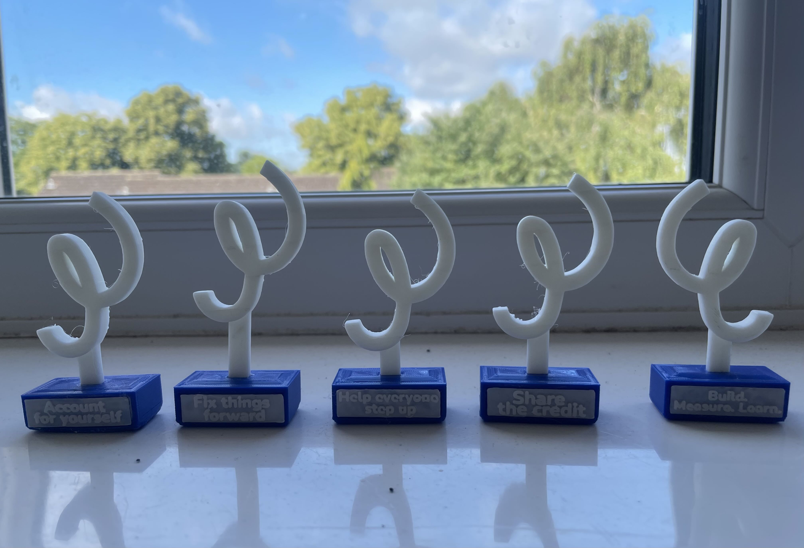

# Squiggle trophy

TotallyMoney have the 'TM Values' awards, twice a year as part of the Summer and Christmas parties. Everyone nominates their colleagues for the 5 TM values:
- Help everyone step up
- Share the credit
- Build, measure, learn
- Account for yourself
- Fix things forward

We used to have a 3D printer at TM, so somewhere along the way was an idea to print trophies for the winners! This repository contains the original sketchup files for the TM squiggle logo in 3D form, the base and the plaques/labels.

There are three options for the base; either just a plain base on either side, or a base with a slot (and a base with a slot on either side). This slot pairs with the label plates, which slot into the base (quite a tight fit), meaning you don't need any glue to attach the plates. There is a blank plate in the repo so it can be customised with any wording. The squiggle also attaches by simply pushing into the base, so no super glue is required at all!
